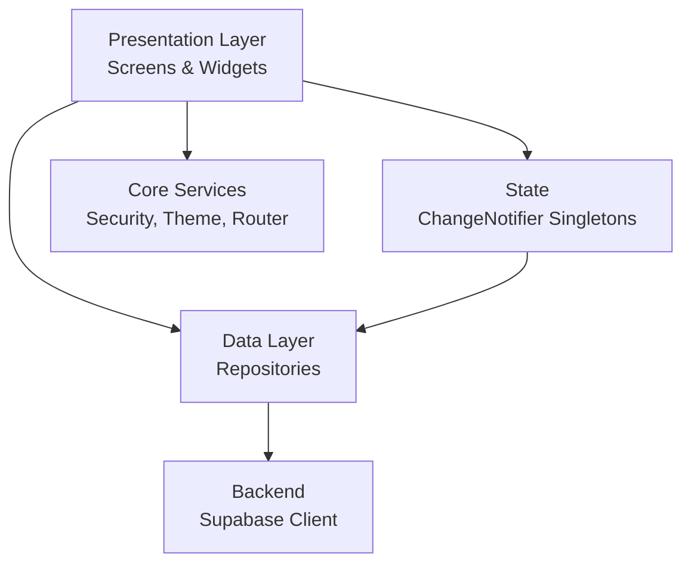

# DaktarPai — Architecture Overview

## 1. High-Level Summary

DaktarPai is a healthcare mobile application built with **Flutter** (Material 3, Dart) and **Supabase** as the backend (auth, database, storage, realtime). It connects patients with doctors — enabling appointment booking, medical record management, and secure account handling with multi-factor authentication.

## 2. Project Structure

```
lib/
├── main.dart                   # App entry point, Supabase init, error telemetry, device integrity
├── app.dart                    # MaterialApp.router with theme, locale, guards
├── core/                       # Cross-cutting concerns (theme, routing, security, utils)
│   ├── constants/              # Route paths (AppRoutes)
│   ├── errors/                 # AppFailure (typed error class)
│   ├── localization/           # AppLocalizations (en/bn)
│   ├── main_wrapper/           # Bottom-nav shell + custom drawer
│   ├── network/                # OfflineModeGuard (connectivity_plus)
│   ├── router/                 # GoRouter config + auth refresh stream
│   ├── security/               # Biometric, device integrity, inactivity lock, step-up
│   ├── services/               # Appointment notifications, error telemetry
│   ├── theme/                  # Colors, typography, motion, shapes, dimensions, styles
│   ├── utils/                  # Formatters (backup code), navigation helpers
│   └── widgets/                # App-wide error fallback, route error screen
├── data/                       # Shared data services
│   └── services/user_service.dart
├── features/                   # Feature modules (vertical slices)
│   ├── appointments/           # Split booking flow (Step 1: Patient form, Step 2: Confirmation/Reminders), my appointments
│   ├── auth/                   # Login, signup, 2FA verify, repositories, security gate
│   ├── common/                 # Enable location screen
│   ├── doctors/                # Doctor list, details, clinics, favorites, map/navigation
│   ├── home/                   # Home screen (dashboard), home repository
│   ├── legal/                  # Terms of service screen
│   ├── medical_records/        # Record CRUD, file viewer, security-gated access
│   ├── menu/                   # Settings screen, privacy policy, linked accounts, drawer
│   ├── profile/                # Profile edit screen, notifier, repository, model
│   ├── settings/               # SettingsNotifier (theme, notifications, timeout)
│   ├── splash/                 # Splash screen with auth redirect
│   └── support/                # Help center screen
├── presentation/               # Shared reusable widgets
│   └── widgets/                # Buttons, cards, inputs, snackbar, search bar
└── services/                   # Global services
```

## 3. Architectural Pattern

The app follows a **feature-first, layered architecture**:



Each feature module is structured as:

| Sub-folder | Purpose |
|---|---|
| `data/` | Models (Freezed + JSON), repositories (Supabase CRUD) |
| `presentation/screens/` | Full-page screen widgets |
| `presentation/widgets/` | Feature-specific reusable UI components |
| `presentation/models/` | Route argument classes |
| `presentation/` | Notifiers (ChangeNotifier singletons for state) |

## 4. Key Architectural Decisions

| Decision | Rationale |
|---|---|
| **GoRouter** | Declarative routing with auth redirects, deep linking, shell routes for bottom nav |
| **Supabase** | Unified backend: Postgres DB, Auth (email + Google + MFA), Storage, Realtime |
| **ChangeNotifier singletons** | Lightweight state management without external packages (Provider/Riverpod) |
| **Freezed models** | Immutable, union-typed data classes with JSON serialization |
| **Feature-first modules** | Each feature owns its data + presentation layers; core is shared |
| **Security-first design** | Device integrity, inactivity lock, biometric step-up, trusted devices, AAL2 gates |

## 5. Dependency Graph

```
main.dart
  └── app.dart (MyApp)
        ├── AppTheme (light/dark)
        ├── SettingsNotifier (theme mode listener)
        ├── appRouter (GoRouter)
        │     ├── SplashScreen → AuthEntryRouteService → home/login/verify2fa
        │     ├── Auth screens (login, signup, verify2fa)
        │     ├── StatefulShellRoute (MainWrapper)
        │     │     ├── HomeScreen
        │     │     ├── DoctorsScreen
        │     │     ├── MyAppointmentsScreen
        │     │     └── ProfileTab (view + edit)
        │     └── Standalone screens (settings, medical records, doctor details, etc.)
        ├── OfflineModeGuard (connectivity banner)
        └── InactivityLockGuard (session timeout + biometric unlock)
```

## 6. Backend Integration (Supabase)

| Feature | Supabase Service |
|---|---|
| User auth (email/password, Google) | `supabase.auth` |
| MFA (TOTP enrollment, challenge, verify) | `supabase.auth.mfa` |
| Recovery codes | `supabase.rpc('use_recovery_code')` |
| Doctor/clinic/schedule data | `supabase.from('doctors')`, etc. filtered by `country_iso` |
| Appointments CRUD + realtime | `supabase.from('appointments')` + channels |
| Medical records + file storage | `supabase.from('medical_records')` + `supabase.storage` |
| Profile data + avatar upload | `supabase.from('profiles')` + `supabase.storage` |
| Family members / secondary profiles | `supabase.from('saved_patients')` (relational table) |
| Trusted devices | `supabase.from('trusted_devices')` |

## 7. File Inventory

| Layer | File Count |
|---|---|
| `core/` | 28 files |
| `features/` | 72+ files (12 feature modules) |
| `presentation/widgets/` | 15 shared widgets |
| `data/services/` | 1 file |
| **Total** | **~120 Dart files** |
