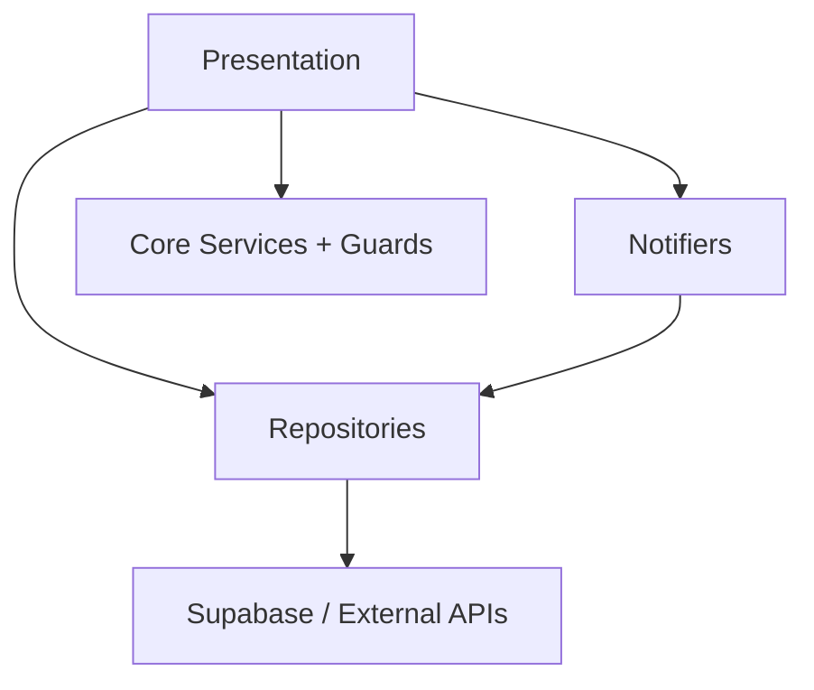

# DaktarPai - Architecture Overview

## 1. High-Level Summary

DaktarPai is a Flutter healthcare app with Supabase as the primary backend (auth, database, realtime, storage, and edge functions). The app includes doctor discovery, appointment booking, reviews, profile/settings security, and medical records.

Current architecture reflected in source:
- Doctor map/navigation moved into a dedicated `ClinicLocationMapSection` widget.
- Doctor view analytics is tracked via delayed screen-stay timer plus Supabase RPC (`increment_doctor_views_smart`).
- Appointment realtime subscription is now owned globally by `AppointmentNotifier` rather than screen-local wiring.
- `MainWrapper` refreshes critical notifiers when app lifecycle returns to `resumed`.
- Appointment cancellation now throws typed `AppFailure` fallback messages instead of raw debug exceptions.

## 2. Project Structure

```text
lib/
  main.dart
  app.dart
  core/
    constants/
    errors/
    localization/
    main_wrapper/
    network/
    router/
    security/
    services/
    theme/
    utils/
    widgets/
  features/
    appointments/
    auth/
    common/
    doctors/
    home/
    legal/
    medical_records/
    menu/
    profile/
    settings/
    splash/
    support/
  presentation/
    widgets/
```

## 3. Architectural Pattern

Feature-first layered architecture:
- Presentation layer: screens/widgets and local UI state.
- Shared state layer: singleton `ChangeNotifier` instances.
- Data layer: repositories for Supabase and external APIs.
- Core layer: router, guards, security, telemetry, theme, and app shell.



## 4. Key Architectural Decisions

| Decision | Rationale |
|---|---|
| GoRouter + shell routing | Centralized redirects with persistent tab scaffolding |
| Supabase-first backend | Unified auth/data/realtime/storage/edge-function path |
| Singleton notifiers | Lightweight global state without introducing extra frameworks |
| Global notifier-owned realtime | Background appointment freshness across all tabs/screens |
| Feature modularization | Isolates complex UI logic (for example, map/navigation widget) |
| Security-first startup | Device integrity checks before app render |
| Production-friendly failures | `AppFailure` normalization with user-safe fallback messaging |

## 5. Runtime Composition

Startup (`main.dart`):
1. Initialize bindings and environment.
2. Initialize Supabase.
3. Load settings and notification services.
4. Run device-integrity enforcement.
5. Configure telemetry/error handlers.
6. Start app inside `runZonedGuarded`.

Global wrappers and shell:
- `app.dart` applies `OfflineModeGuard` and `InactivityLockGuard`.
- `MainWrapper` initializes appointment realtime, does initial profile/appointment sync, and triggers silent refresh on app resume.

## 6. Backend Integration Snapshot

| Area | Source |
|---|---|
| Authentication and MFA | `supabase.auth`, `supabase.auth.mfa` |
| Doctors, specialties, clinics, schedules | `doctors`, `specialties`, `clinics`, `doctor_clinics`, `doctor_schedules` |
| Doctor view analytics | RPC `increment_doctor_views_smart` |
| Appointments and history | `appointments`, `appointment_history` |
| Automated Status Management | Supabase `pg_cron` (auto-marks confirmed as waiting based on clinic max_wait_time, and missed after a 15-min grace period) |
| Clinic Configuration | `doctor_clinics` stores `min_wait_time` and `max_wait_time` as calculable integers. |
| Reviews & Complaints | `reviews`, `complaints` (with support/doctor routing) |
| Appointment realtime | Supabase channel on `public.appointments` (managed by notifier) |
| Route geometry | OSRM direct call with Supabase edge-function fallback (`route-proxy`) |
| Profiles and saved patients | `profiles`, `saved_patients` |
| Medical records | `medical_records` + storage |
| Trusted devices | `trusted_devices` |

## 7. Native and Plugin Integration

| Capability | Implementation |
|---|---|
| Calendar event creation | `add_2_calendar` from appointment flows |
| Android calendar intent visibility | Manifest `<queries>` for calendar insert intent/mime |
| Android predictive back compatibility | `android:enableOnBackInvokedCallback="true"` |
| iOS calendar/contacts disclosure | `NSCalendarsUsageDescription`, `NSContactsUsageDescription` |

## 8. Current Behavior Notes

- Cancellation path uses typed `AppFailure` mapping and user-friendly fallback messages.
- Pending review UX is backed by completed appointments without existing reviews.
- Activity log injects `has_review` from `reviews` lookup to suppress duplicate review prompts.

## 9. Relevant Packages

- `supabase_flutter`
- `go_router`
- `flutter_map`
- `latlong2`
- `geolocator`
- `flutter_local_notifications`
- `local_auth`
- `add_2_calendar`
