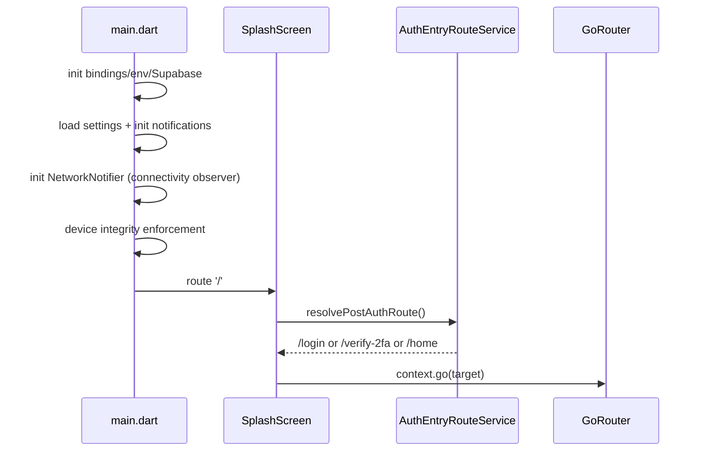

# DaktarPai - App Flow and Navigation

## 1. Startup Flow

## 2. Route Map

Defined in:
- `lib/core/constants/app_routes.dart`
- `lib/core/router/app_router.dart`

| Path | Screen |
|---|---|
| `/` | `SplashScreen` |
| `/login` | `LoginScreen` |
| `/signup` | `SignUpScreen` |
| `/verify-2fa` | `Verify2FAScreen` |
| `/home` | `HomeScreen` (shell tab) |
| `/doctors` | `DoctorsScreen` (shell tab) |
| `/appointments` | `MyAppointmentsScreen` (shell tab) |
| `/profile` | `ProfileViewScreen` (shell tab) |
| `/profile/edit` | `ProfileScreen` |
| `/settings` | `SettingsScreen` |
| `/linked-accounts` | `LinkedAccountsScreen` |
| `/medical_records` | `MedicalRecordsScreen` |
| `/add_medical_record` | `AddRecordScreen` |
| `/appointment_booking` | `PatientDetailsScreen` |
| `/payment_method` | `AppointmentConfirmationScreen` |
| `/dummy_payment` | `DummyPaymentScreen` |
| `/doctor_details/:id` | `DoctorDetailsScreen` |
| `/specialty_doctors/:id` | `SpecialtyDoctorsScreen` |
| `/clinic_doctors/:id` | `ClinicDoctorsScreen` |
| `/global_search` | `GlobalSearchScreen` |
| `/popular_doctors` | `PopularDoctorsScreen` |
| `/featured_doctors` | `FeaturedDoctorsScreen` |
| `/my_doctors` | `MyDoctorsScreen` |
| `/privacy_policy` | `PrivacyPolicyScreen` |
| `/terms_of_service` | `TermsOfServiceScreen` |
| `/help-center` | `HelpCenterScreen` |
| `/location_permission` | `EnableLocationScreen` |

Additional push pattern:
- `AccountActivityScreen` is opened from settings via `Navigator.push(...)`.

## 3. Redirect Rules

Global redirect behavior:
- If user is unauthenticated and target is protected, redirect to `/login?from=<target>`.
- Auth routes (`/`, `/login`, `/signup`, `/verify-2fa`) are exempt from auth redirect loops.

## 4. Shell Navigation

`StatefulShellRoute.indexedStack` is hosted in `MainWrapper` with 4 branches:
1. Home
2. Doctors
3. Appointments
4. Profile

`MainWrapper` responsibilities:
- App-wide drawer + tab transition choreography.
- One-time appointment realtime bootstrap.
- Initial and resume refresh (`appointments`, `profile`).
- `resizeToAvoidBottomInset: false` to keep shell layout stable while keyboard opens in nested flows.
- Shell-level offline UX wrapping via `OfflineModeGuard` so network state is visible across all tabs.

## 5.1 Realtime + Offline Replay Flow

On connection restoration:
1. `NetworkNotifier` detects transition from offline to online.
2. `_syncOfflineQueues()` runs and replays repository queues in sequence.
3. Domain notifiers/screens receive fresh data from repository fetch/realtime streams.
4. UI state converges without requiring a manual user refresh.

## 5. Core User Journeys

### Authentication
1. Splash resolves target route.
2. Login/signup or 2FA verification.
3. Post-auth routing via `AuthEntryRouteService`.

### Booking
1. Doctor details selection.
2. `PatientDetailsScreen` (patient info step).
3. `AppointmentConfirmationScreen` (confirmation step).
4. `DummyPaymentScreen` (completion).
5. Return to appointments/home depending on action.

### Appointments Management
- `MyAppointmentsScreen` uses `AppointmentNotifier` state.
- Action sheet supports add-to-calendar, reschedule, complete, cancel.
- Action Required carousel supports pending review and pending complaint paths.

### Medical Records
- List in `MedicalRecordsScreen`.
- Add/edit in `AddRecordScreen`.

## 6. Online-Only Route/Action Gates

The app keeps read-only browsing available offline where cached data exists, while gating operations that require active network access:
- global doctor search and live server-backed filters,
- signed URL generation for private files,
- binary uploads (profile image, medical documents),
- live appointment slot validations.

Offline attempts return controlled `AppFailureType.network` feedback instead of blocking the navigator or freezing the screen.

## 6. Input and Keyboard UX in Flows

Navigation-adjacent input behavior now follows a consistent pattern:
- App input surfaces are standardized on `AppTextField`.
- Input dialogs/sheets use scroll or insets-safe composition where needed.
- Global tap-to-unfocus in `app.dart` reduces stuck-keyboard transition issues.
