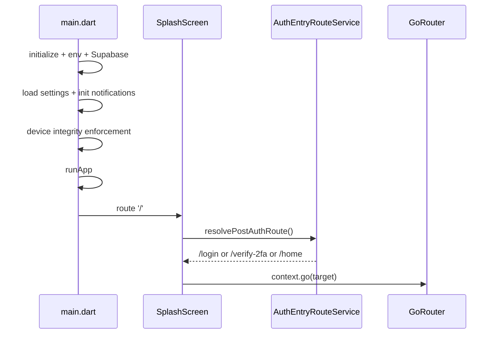

# DaktarPai - App Flow and Navigation

## 1. Startup Flow

## 2. Router Table

Defined in `lib/core/router/app_router.dart` and `lib/core/constants/app_routes.dart`.

| Path | Screen |
|---|---|
| `/` | SplashScreen |
| `/login` | LoginScreen |
| `/signup` | SignUpScreen |
| `/verify-2fa` | Verify2FAScreen |
| `/home` | HomeScreen (shell tab) |
| `/doctors` | DoctorsScreen (shell tab) |
| `/appointments` | MyAppointmentsScreen (shell tab) |
| `/profile` | ProfileViewScreen (shell tab) |
| `/profile/edit` | ProfileScreen |
| `/settings` | SettingsScreen |
| `/linked-accounts` | LinkedAccountsScreen |
| `/medical_records` | MedicalRecordsScreen |
| `/add_medical_record` | AddRecordScreen |
| `/appointment_booking` | PatientDetailsScreen |
| `/payment_method` | AppointmentConfirmationScreen |
| `/dummy_payment` | DummyPaymentScreen |
| `/doctor_details/:id` | DoctorDetailsScreen |
| `/popular_doctors` | PopularDoctorsScreen |
| `/featured_doctors` | FeaturedDoctorsScreen |
| `/specialty_doctors/:id` | SpecialtyDoctorsScreen |
| `/clinic_doctors/:id` | ClinicDoctorsScreen |
| `/my_doctors` | MyDoctorsScreen |
| `/privacy_policy` | PrivacyPolicyScreen |
| `/terms_of_service` | TermsOfServiceScreen |
| `/help-center` | HelpCenterScreen |
| `/location_permission` | EnableLocationScreen |

Non-router push pattern:
- `AccountActivityScreen` is currently opened from settings via `Navigator.push(MaterialPageRoute(...))`.

## 3. Redirect Behavior

Global redirect checks current auth session.
- Unauthenticated users are redirected to `/login?from=<target>`.
- Auth screens are exempt from redirect loops.

## 4. Main Shell Navigation

`StatefulShellRoute.indexedStack` is hosted by `MainWrapper` with 4 branches:
1. Home
2. Doctors
3. Appointments
4. Profile

`MainWrapper` responsibilities:
- custom drawer gestures and animation
- appointment notifier realtime bootstrap
- initial silent refresh (`appointments`, `profile`)
- app-resume refresh when lifecycle returns to `resumed`

## 5. Doctor Details Flow

1. `DoctorDetailsScreen` loads doctor + clinic/schedule data.
2. On successful load, it starts a 3-second view timer.
3. Timer triggers `DoctorRepository.incrementDoctorViewCount(...)`.
4. Location/map experience is handled by `ClinicLocationMapSection`.
5. Screen content supports pull-to-refresh via `RefreshIndicator`.

## 6. Booking Journey

1. Doctor details and clinic/date selection
2. Step 1: `PatientDetailsScreen`
3. Step 2: `AppointmentConfirmationScreen`
4. Step 3: `DummyPaymentScreen`
5. Success navigation to `/appointments`

Calendar entry points:
- Step 3 success dialog (`Add to Calendar`)
- My Appointments action sheet (`Add to Device Calendar`)

## 7. My Appointments Flow

`MyAppointmentsScreen` behavior:
- listens to `AppointmentNotifier` state
- does not own realtime channel lifecycle anymore
- supports pull-to-refresh in all list states
- shows Action Required carousel for both pending reviews AND pending complaints when data is present

`AppointmentNotifier` behavior:
- owns Supabase realtime channel setup/teardown
- listens to auth-state changes to resubscribe/clear safely
- fetches appointments, pending reviews, and pending complaints together, exposing a combined `actionRequiredItems` list

## 8. Account Activity Flow

1. Settings -> `Account Activity`
2. `AccountActivityScreen` fetches history via `fetchActivityLog(userId)`
3. Activity rows dynamically adapt to the appointment status:
   - `COMPLETED` actions (without `has_review`) show a "Leave a Review" CTA.
   - `MISSED` actions show a "File Complaint" CTA.
   - `WAITING` actions show an amber informational banner notifying the user of the 15-minute grace period delay.
4. Review submission triggers list refresh

## 9. App-Level Guards

`app.dart` wraps routed content with:
- `OfflineModeGuard`
- `InactivityLockGuard`

These guards apply across all routes and shell branches.
