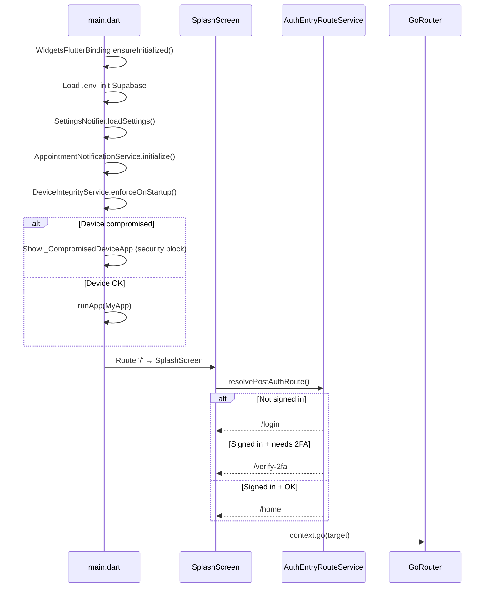

# DaktarPai — App Flow & Navigation

## 1. Startup Flow



**Source files:**
- [main.dart](file:///C:/skills%20development/daktarpi/lib/main.dart)
- [splash_screen.dart](file:///C:/skills%20development/daktarpi/lib/features/splash/presentation/screens/splash_screen.dart)
- [auth_entry_route_service.dart](file:///C:/skills%20development/daktarpi/lib/features/auth/data/auth_entry_route_service.dart)

## 2. Router Configuration

**File:** [app_router.dart](file:///C:/skills%20development/daktarpi/lib/core/router/app_router.dart)

### Route Table

| Route Path | Screen | Nav Type |
|---|---|---|
| `/` | SplashScreen | Root |
| `/login` | LoginScreen | Root |
| `/signup` | SignUpScreen | Root |
| `/verify-2fa` | Verify2FAScreen | Root |
| `/home` | HomeScreen | Shell tab 0 |
| `/doctors` | DoctorsScreen | Shell tab 1 |
| `/appointments` | MyAppointmentsScreen | Shell tab 2 |
| `/profile` | ProfileTabScreen | Shell tab 3 |
| `/profile/edit` | ProfileScreen | Root (over shell) |
| `/settings` | SettingsScreen | Root |
| `/medical_records` | MedicalRecordsScreen | Root |
| `/add_medical_record` | AddRecordScreen | Root |
| `/doctor_details/:id` | DoctorDetailsScreen | Root |
| `/popular_doctors` | PopularDoctorsScreen | Root |
| `/featured_doctors` | FeaturedDoctorsScreen | Root |
| `/specialty_doctors/:id` | SpecialtyDoctorsScreen | Root |
| `/clinic_doctors/:id` | ClinicDoctorsScreen | Root |
| `/my_doctors` | MyDoctorsScreen | Root |
| `/appointment_booking` | PatientDetailsScreen (Step 1) | Root |
| `/payment_method` | AppointmentConfirmationScreen (Step 2) | Root |
| `/privacy_policy` | PrivacyPolicyScreen | Root |
| `/terms_of_service` | TermsOfServiceScreen | Root |
| `/help-center` | HelpCenterScreen | Root |
| `/linked-accounts` | LinkedAccountsScreen | Root |
| `/location_permission` | EnableLocationScreen | Root |

### Auth Redirect

The router has a global `redirect` that checks `Supabase.instance.client.auth.currentSession`. If no session exists and the user is not already on an auth screen (`/login`, `/signup`, `/verify-2fa`, `/`), they are redirected to `/login?from=<original_path>`.

**File:** [auth_refresh_stream.dart](file:///C:/skills%20development/daktarpi/lib/core/router/auth_refresh_stream.dart) — wraps `onAuthStateChange` as a `ChangeNotifier` for `refreshListenable`.

## 3. Shell Navigation (Bottom Tabs)

**File:** [main_wrapper.dart](file:///C:/skills%20development/daktarpi/lib/core/main_wrapper/main_wrapper.dart)

The `MainWrapper` uses `StatefulShellRoute.indexedStack` with 4 branches and a custom animated bottom nav bar + a gesture-based custom drawer.

| Tab Index | Label | Screen | Navigator Key |
|---|---|---|---|
| 0 | Home | HomeScreen | `shellHome` |
| 1 | Doctors | DoctorsScreen | `shellDoctors` |
| 2 | Appointments | MyAppointmentsScreen | `shellAppointments` |
| 3 | Profile | ProfileTabScreen | `shellProfile` |

### Drawer Animation

The `MainWrapper` implements a custom sliding drawer using `AnimationController`:
- **Swipe gesture:** `GestureDetector` with `_onDragStart`, `_onDragUpdate`, `_onDragEnd` handlers
- The main content slides right with `Transform.translate`, clips with `BorderRadius`, and scales down
- Drawer hint animation: first-time users see a subtle swipe hint (controlled by `SettingsNotifier.showDrawerHint`)

**Source:** [custom_drawer.dart](file:///C:/skills%20development/daktarpi/lib/features/menu/presentation/widgets/custom_drawer.dart)

## 4. User Journey Flows

### 4.1 Authentication Flow

```
Launch → Splash → Login Screen
                    ├── Email/Password sign-in → 2FA check → Home
                    ├── Google sign-in → 2FA check → Home
                    ├── Forgot password → Email → OTP → New password → Login
                    └── Sign up → Create account → Home
```

### 4.2 Doctor Discovery Flow

```
Home → Specialty grid / Popular list / Featured list → Doctor list
    └── Doctor Details Screen
          ├── View info, stats, schedule
          ├── Select clinic location (location picker)
          ├── Map integration (FlutterMap + CartoDB Voyager)
          │     ├── Center on user / clinic
          │     ├── In-app navigation (smooth polyline draw with "Calculating..." spinner)
          │     └── External maps (Google Maps / Apple Maps)
          ├── Select date + time slot
          └── Book → Patient Details (Step 1: Form) → Confirmation (Step 2: Checkout/Reminders) → My Appointments
```

### 4.3 Medical Records Flow

```
Medical Records Screen
  ├── Security check (no 2FA/biometric → force setup)
  ├── Biometric suggestion (if hardware available but not linked)
  ├── Fetch records (requires AAL2)
  │     ├── Biometric step-up (trusted device)
  │     └── Full 2FA verify (TOTP/backup code)
  ├── View records (list of RecordCards)
  │     ├── Edit record
  │     ├── Delete record
  │     └── View file (image viewer / document download)
  └── Add record
```

### 4.4 Settings Flow

```
Settings Screen (from drawer)
  ├── Account & Security
  │     ├── Change Password (2FA-gated)
  │     ├── Two-Factor Authentication toggle
  │     │     ├── Enable → 2FA Setup Wizard (QR → verify → backup codes)
  │     │     └── Disable → 2FA Verify dialog
  │     ├── Change Authenticator App (disable then re-enable)
  │     ├── Recovery Codes (generate/regenerate)
  │     ├── Biometric Login toggle (2FA-gated)
  │     ├── Linked Accounts
  │     └── Forget This Device
  ├── Preferences
  │     ├── Notifications toggle
  │     ├── Inactivity Lock timeout
  │     ├── Appearance (System/Light/Dark)
  │     ├── Currency (auto-detected from location)
  │     └── Menu Drawer Hint toggle
  ├── Support & Legal
  │     ├── Help Center
  │     ├── Privacy Policy
  │     └── Terms of Service
  └── Delete Account (with confirmation + 2FA verify)
```

## 5. App-Level Guards

**File:** [app.dart](file:///C:/skills%20development/daktarpi/lib/app.dart)

The `MaterialApp.router` builder wraps all screens in two guards:

```dart
OfflineModeGuard(
  child: InactivityLockGuard(
    timeout: _resolveInactivityTimeout(),
    absoluteTimeout: _resolveAbsoluteSessionTimeout(),
    child: child,
  ),
)
```

| Guard | Purpose | Source |
|---|---|---|
| `OfflineModeGuard` | Shows yellow "Offline Mode" banner when no internet | [offline_mode_guard.dart](file:///C:/skills%20development/daktarpi/lib/core/network/offline_mode_guard.dart) |
| `InactivityLockGuard` | Locks app after configurable inactivity timeout; biometric unlock or sign-out | [inactivity_lock_guard.dart](file:///C:/skills%20development/daktarpi/lib/core/security/inactivity_lock_guard.dart) |
