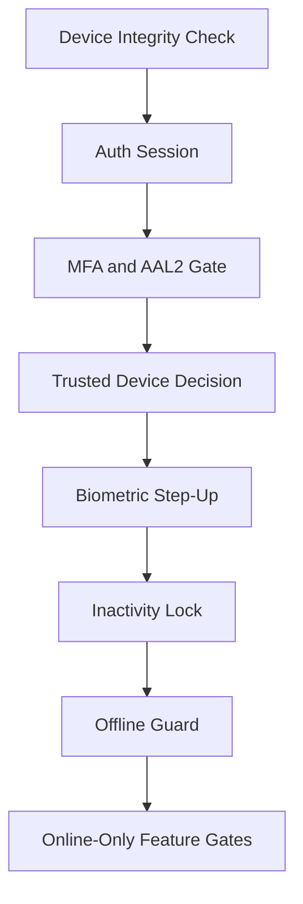

# DaktarPai - Security Architecture

## 1. Security Model

DaktarPai applies layered controls from startup through runtime interaction.

## 2. Startup Security

`DeviceIntegrityService.enforceOnStartup()` runs before app render.

If compromised state is detected, startup flow enforces:
1. clear sensitive local data,
2. sign out,
3. render a blocked compromised-device UI.

## 3. Auth and Route Protection

- `AuthRepository` wraps auth operations.
- Router refresh listens to Supabase auth state.
- Protected routes redirect unauthenticated users to login with intended-route query.

Post-auth entry routing (`AuthEntryRouteService`):
- no session -> `/login`
- step-up route required -> `/verify-2fa`
- valid session -> `/home`

## 4. MFA, AAL2, and Step-Up

Implemented controls include:
- TOTP enrollment/verification.
- Recovery code fallback.
- AAL2 checks via `SecurityGateService`.
- Sensitive operation gating in settings/account flows.

Security dialogs in these flows use standardized `AppTextField` for backup code/password input.

## 5. Trusted Device and Biometric Controls

Main components:
- `TrustedDeviceRepository`
- `BiometricAuthService`
- `SensitiveActionStepUpService`

Responsibilities:
- trusted-device lifecycle,
- biometric capability checks,
- biometric prompt orchestration,
- fall back to MFA challenge when needed.

## 6. Session Controls

`InactivityLockGuard` enforces:
- inactivity timeout lock,
- unlock flow,
- absolute timeout sign-out.

`MainWrapper` triggers resume-time data refresh for critical state (`appointments`, `profile`).

## 7. Data Access Integrity

- Appointment realtime ownership is centralized in `AppointmentNotifier`.
- Auth-state changes trigger realtime subscription refresh/cleanup.
- Repository operations map backend/network failures through `AppFailure` where implemented.
- Complaint flow relies on user-bound records and server-side access controls.
- Offline write actions are captured in repository queues and replayed only when a live network is available.

## 8. Online-Only Guardrails

Connectivity-aware gating is enforced for operations that cannot be safely executed offline:
- storage uploads of binary files,
- signed URL generation for private assets,
- live server-dependent search/availability checks.

If these actions are attempted while offline, repositories return `AppFailureType.network` with user-safe messaging.

## 9. Local Data Storage Constraints

To reduce memory and privacy risk:
- Hive stores lightweight JSON payloads and storage path/URL references only.
- Heavy binaries (images, PDFs, map data) are excluded from local persistence.
- Cache entries are bounded by a 60-minute validity window to avoid stale long-lived snapshots.

## 10. Error Containment and Telemetry

Global capture paths in `main.dart`:
- `FlutterError.onError`
- `PlatformDispatcher.instance.onError`
- `runZonedGuarded`

`ErrorTelemetryService` logs these paths, and `AppErrorFallback` provides controlled recovery UI.

## 11. Platform Privacy/Permission Notes

Android:
- calendar intent visibility declarations in manifest.
- predictive back compatibility flag enabled.

iOS:
- calendar/contact usage descriptions in `Info.plist`.
