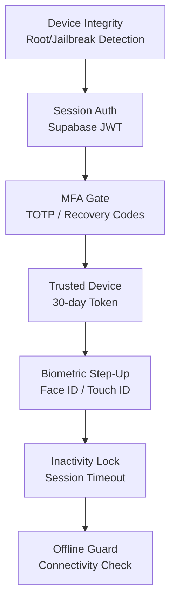

# DaktarPai — Security Architecture

## 1. Security Overview

DaktarPai implements a defense-in-depth security model. Every layer independently protects against common threats.



## 2. Startup Security

**File:** [device_integrity_service.dart](file:///C:/skills%20development/daktarpi/lib/core/security/device_integrity_service.dart)

Before the app renders, `DeviceIntegrityService.enforceOnStartup()` checks for rooted/jailbroken devices via a native `MethodChannel` (`com.daktarpi/device_integrity`). If compromised:
1. All `FlutterSecureStorage` data is wiped
2. The user is signed out
3. A blocking `_CompromisedDeviceApp` screen is shown (no way to proceed)

## 3. Authentication Layer

**File:** [auth_repository.dart](file:///C:/skills%20development/daktarpi/lib/features/auth/data/auth_repository.dart)

`AuthRepository` wraps all `Supabase.instance.client.auth` calls. No screen or service talks to Supabase directly.

| Method | Purpose |
|---|---|
| `signUp()` | Email/password registration with optional metadata |
| `signIn()` | Email/password login, returns session |
| `signInWithGoogleIdToken()` | OAuth2 via Google ID token |
| `signOut()` | Signs out + clears `ProfileNotifier`, `FavoritesNotifier`, `SettingsNotifier` |
| `refreshSession()` | Force-refreshes the JWT |
| `resetPasswordForEmail()` | Sends password reset OTP |
| `verifyRecoveryOtp()` | Verifies email-based OTP for password reset |
| `updatePassword()` | Changes password (requires recent auth) |
| `deleteUserAccount()` | Calls `rpc('delete_user_account')` server-side |

### Auth State Redirect

**File:** [auth_refresh_stream.dart](file:///C:/skills%20development/daktarpi/lib/core/router/auth_refresh_stream.dart)

Wraps `onAuthStateChange` as a `ChangeNotifier` so `GoRouter.refreshListenable` reacts to sign-in/sign-out events. Combined with the router's `redirect` callback, unauthenticated users are always sent to `/login`.

### Post-Auth Routing

**File:** [auth_entry_route_service.dart](file:///C:/skills%20development/daktarpi/lib/features/auth/data/auth_entry_route_service.dart)

`AuthEntryRouteService.resolvePostAuthRoute()` determines where to send the user after authentication:
- No session → `/login`
- Session requires AAL2 step-up → `/verify-2fa`
- Session OK → `/home`

**File:** [auth_route_resolver.dart](file:///C:/skills%20development/daktarpi/lib/features/auth/data/auth_route_resolver.dart)

Pure logic for resolving the correct auth route, separated from side effects for testability.

## 4. Multi-Factor Authentication (MFA / 2FA)

### TOTP Enrollment Flow

**File:** [settings_screen.dart](file:///C:/skills%20development/daktarpi/lib/features/menu/presentation/screens/settings_screen.dart) — `_start2FASetupWizard()`

1. **Info step:** Explains what 2FA is
2. **QR step:** `AuthRepository.enrollTotp()` returns a QR code URI; user scans with authenticator app; enters 6-digit code to verify
3. **Backup codes step:** `AuthRepository.saveRecoveryCodes()` generates and displays backup codes; user must acknowledge
4. **Success step:** 2FA is now active

### TOTP Verification

**File:** [verify_2fa_screen.dart](file:///C:/skills%20development/daktarpi/lib/features/auth/presentation/screens/verify_2fa_screen.dart)

Full-screen verification with two modes:
- **OTP mode:** 6-digit code from authenticator app → `SecurityGateService.verifyWithTotp()`
- **Recovery mode:** 8-character backup code → `SecurityGateService.verifyWithRecoveryCode()`

Features:
- "Remember this device" checkbox → stores a trusted device token
- Recovery assist timer (5-second delay before showing "Lost your authenticator?" link)
- Clipboard auto-detect for recovery codes
- Cancel button signs out (if not `popOnSuccess`)

### Security Gate Service

**File:** [security_gate_service.dart](file:///C:/skills%20development/daktarpi/lib/features/auth/data/security_gate_service.dart)

```dart
enum SecurityGateStatus { allow, requiresStepUp, unauthenticated }
```

`SecurityGateService.evaluateAal2Gate()` checks if the current session satisfies AAL2. The service delegates to an abstract `SecurityAuthProvider` (implemented by `AuthRepositorySecurityProvider`) for testability.

## 5. Trusted Device System

**File:** [trusted_device_repository.dart](file:///C:/skills%20development/daktarpi/lib/features/auth/data/trusted_device_repository.dart)

| Method | Description |
|---|---|
| `trustCurrentDevice()` | Generates a UUID token, SHA-256 hashes it, stores hash + TTL in Supabase `trusted_devices` table, stores raw token locally in `FlutterSecureStorage` |
| `trustDevice()` | Core implementation with `userId`, `ttl` (default 30 days), `isBiometricEnabled` flag |
| `isTrustedDeviceValid()` | Reads local token, checks expiry, validates hash against server |
| `isBiometricEnabledForDevice()` | Checks if the trusted device has biometric flag set |
| `revokeCurrentDevice()` | Deletes server record + clears local token |
| `clearLocalToken()` | Removes local `FlutterSecureStorage` entry |

**Security model:**
- Raw token never leaves the device
- Server stores only SHA-256 hash
- Token expires after 30 days
- Each device has its own independent token

## 6. Biometric Authentication

### BiometricAuthService

**File:** [biometric_auth_service.dart](file:///C:/skills%20development/daktarpi/lib/core/security/biometric_auth_service.dart)

Wraps `local_auth` package:
- `canUseBiometricUnlock()` — checks hardware support + available biometrics
- `authenticate()` — Face ID / Touch ID with `biometricOnly: true`, `stickyAuth: true`

### SensitiveActionStepUpService

**File:** [sensitive_action_step_up_service.dart](file:///C:/skills%20development/daktarpi/lib/core/security/sensitive_action_step_up_service.dart)

Combines biometric check + trusted device check:
1. Check if device has biometric hardware
2. Check if user has a valid trusted device with biometric enabled
3. If both → prompt biometric authentication
4. Return `true` (bypass TOTP) or `false` (fall through to 2FA screen)

### BiometricHelperService

**File:** [biometric_helper_service.dart](file:///C:/skills%20development/daktarpi/lib/core/security/biometric_helper_service.dart)

Higher-level helpers for biometric-related operations.

### BiometricSecurityService

**File:** [biometric_security_service.dart](file:///C:/skills%20development/daktarpi/lib/core/security/biometric_security_service.dart)

Additional security-focused biometric utilities.

## 7. Inactivity Lock

**File:** [inactivity_lock_guard.dart](file:///C:/skills%20development/daktarpi/lib/core/security/inactivity_lock_guard.dart)

Wraps the entire app and monitors user activity:

| Parameter | Default | Source |
|---|---|---|
| Inactivity timeout | Configurable via `SettingsNotifier.inactivityTimeoutMs` | Settings → Inactivity Lock |
| Absolute session timeout | 12 hours (or `ABSOLUTE_SESSION_TIMEOUT_MS` env var) | Build-time constant |

**Behavior:**
- Resets timer on every user interaction (tap, scroll, etc.)
- On timeout: shows a lock overlay with biometric unlock button
- If biometric available → auto-attempt unlock when backgrounded then resumed
- If absolute timeout exceeded → force sign-out
- Lock overlay shows user's initial avatar, animated gradient background

## 8. Sensitive Action Protection

In `settings_screen.dart`, `_verifyRecentMfaForSensitiveAction()` is called before:
- Changing password
- Toggling 2FA
- Toggling biometric login
- Regenerating recovery codes
- Deleting account
- Changing authenticator app

The method:
1. Tries `SensitiveActionStepUpService.authenticateIfTrusted()` (biometric prompt, no navigation)
2. If biometric fails/unavailable → pushes `/verify-2fa` with `popOnSuccess: true`
3. Returns `true` if verified, `false` if cancelled

## 9. Medical Records Security

**File:** [medical_records_screen.dart](file:///C:/skills%20development/daktarpi/lib/features/medical_records/presentation/screens/medical_records_screen.dart)

Medical records require the highest security level:
1. **No security at all** (no 2FA, no backup codes, no biometric) → Force user to Settings
2. **No biometric linked** → Suggest biometric setup (optional)
3. **Fetch records** with `allowAal1Bypass` if biometric was used
4. If `Requires2FAException` → biometric step-up → if fails → full 2FA verify screen

## 10. Error Handling

### AppFailure

**File:** [app_failure.dart](file:///C:/skills%20development/daktarpi/lib/core/errors/app_failure.dart)

Typed error class with:
- `userMessage` — human-readable message for snackbar display
- `isRequiresRecentMfa` — flag indicating the error requires fresh MFA verification
- Factory constructors for common error types

### Error Telemetry

**File:** [error_telemetry_service.dart](file:///C:/skills%20development/daktarpi/lib/core/services/error_telemetry_service.dart)

Captures errors from three sources:
1. `FlutterError.onError` — framework-level widget errors
2. `PlatformDispatcher.instance.onError` — platform-level errors
3. `runZonedGuarded` — uncaught async errors

The `ErrorWidget.builder` is overridden with `AppErrorFallback` which provides a "Go Home" button instead of the red error screen.
