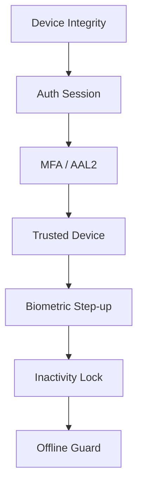

# DaktarPai - Security Architecture

## 1. Security Model

DaktarPai uses layered security from startup checks through runtime session controls.

## 2. Startup Security

`DeviceIntegrityService.enforceOnStartup()` runs before app render.
If a compromised device is detected:
1. secure local data is cleared
2. user is signed out
3. blocking compromised-device UI is shown

## 3. Authentication and Route Security

- `AuthRepository` encapsulates auth operations.
- Router refresh listens to Supabase auth state changes.
- Redirect logic blocks protected routes for unauthenticated sessions.

Post-auth routing via `AuthEntryRouteService`:
- no session -> `/login`
- step-up required -> `/verify-2fa`
- valid session -> `/home`

## 4. MFA and Step-Up Controls

MFA stack includes:
- TOTP enrollment/verification
- recovery code fallback
- AAL2 gate checks via `SecurityGateService`

Sensitive actions use step-up enforcement in settings and records flows.

## 5. Trusted Devices and Biometrics

`TrustedDeviceRepository`, `BiometricAuthService`, and `SensitiveActionStepUpService` provide:
- trusted-device token lifecycle
- biometric capability and prompt orchestration
- step-up bypass path when trusted-device criteria are met

## 6. Session Controls

`InactivityLockGuard` enforces:
- configurable inactivity timeout
- lock/unlock flow
- absolute session timeout sign-out

`MainWrapper` also performs silent data refresh on app resume for key user state (appointments/profile), reducing stale-session UI risk after long background periods.

## 7. Error Containment and Safe Failure Mapping

Global crash/error capture in `main.dart`:
- `FlutterError.onError`
- `PlatformDispatcher.instance.onError`
- `runZonedGuarded`

`AppErrorFallback` provides a controlled fallback UI.

Repository error normalization:
- `AppFailure.fromError(...)` is used broadly to map backend/network failures to user-safe messages.
- Appointment cancellation path now returns typed `AppFailure` fallbacks, not raw SQL/debug strings.

## 8. Data Access and Realtime Integrity

- Appointment realtime is managed in `AppointmentNotifier` (single global ownership).
- Auth-state changes trigger subscription refresh/cleanup to avoid orphaned channels.
- `fetchActivityLog()` cross-checks `reviews` to inject `has_review`, preventing duplicate review prompts.
- **Complaints Integrity**: The `complaints` table is secured via explicit RLS policies. Authenticated users can only INSERT and SELECT complaints where `auth.uid() = user_id`, ensuring absolute privacy for patient disputes.

## 9. Platform Declarations and Privacy

Android:
- Calendar intent queries declared in manifest.
- `android:enableOnBackInvokedCallback="true"` enabled for modern back behavior.

iOS:
- `NSCalendarsUsageDescription` and `NSContactsUsageDescription` present in `Info.plist`.

## 10. Review and Submission Integrity

Review integrity controls in source:
- duplicate-review prevention handled via DB uniqueness + error mapping in `submitReview()`
- pending review list only includes completed appointments with no review record
- account activity and appointments UI both respect that review state
