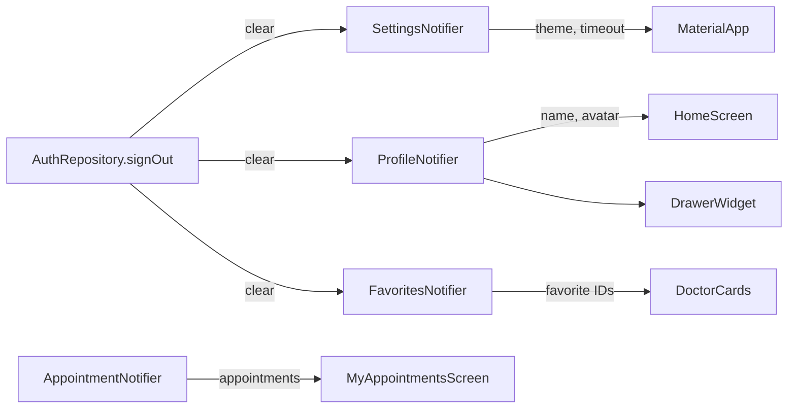
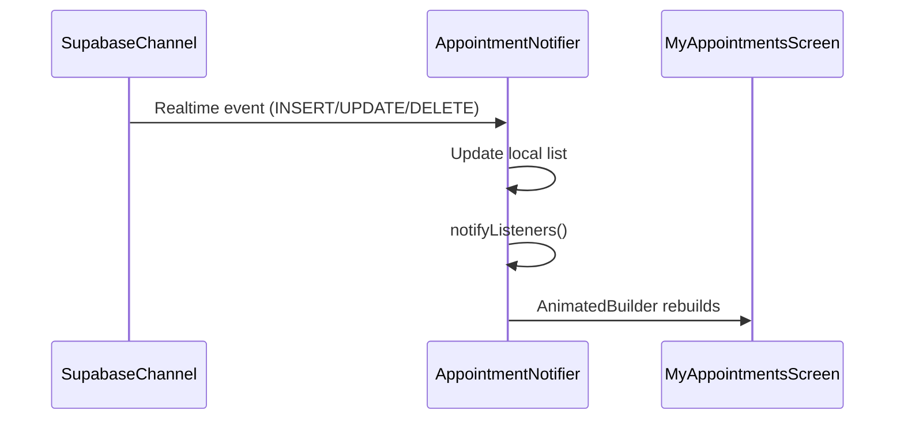

# DaktarPai — State Management & Data Flow

## 1. State Management Pattern

DaktarPai uses **singleton ChangeNotifier** instances for global app state and **StatefulWidget** with `setState()` for local screen state. There is no external state management package (no Provider, Riverpod, Bloc, etc.).



## 2. Global State — ChangeNotifier Singletons

### SettingsNotifier

**File:** [settings_notifier.dart](file:///C:/skills%20development/daktarpi/lib/features/settings/presentation/settings_notifier.dart)

| Property | Type | Default | Persistence |
|---|---|---|---|
| `themeMode` | `ThemeMode` | `ThemeMode.system` | Yes (local) |
| `inactivityTimeoutMs` | `int` | 300000 (5 min) | Yes (local) |
| `showDrawerHint` | `bool` | `true` | Yes (local) |
| `notificationsEnabled` | `bool` | `true` | Yes (local) |

**Methods:**
- `loadSettings()` — Called once at startup from `main.dart`
- `setThemeMode()` — Updates theme + persists
- `setInactivityTimeout()` — Updates timeout + persists
- `setShowDrawerHint()` — Updates hint flag + persists
- `clear()` — Resets all to defaults on logout

**How it drives the UI:**
```dart
// In app.dart
AnimatedBuilder(
  animation: SettingsNotifier.instance,
  builder: (context, child) {
    return MaterialApp.router(
      themeMode: SettingsNotifier.instance.themeMode,
      // ...
    );
  },
)
```

### ProfileNotifier

**File:** [profile_notifier.dart](file:///C:/skills%20development/daktarpi/lib/features/profile/presentation/profile_notifier.dart)

| Property | Type | Description |
|---|---|---|
| `fullName` | `String?` | User's display name |
| `avatarUrl` | `String?` | Profile picture URL |
| `currencySymbol` | `String` | Auto-detected from location |

**Methods:**
- `hydrate()` — Loads from Supabase after login
- `update({name, avatarUrl, currency})` — Updates + notifies
- `clear()` — Resets on logout

### FavoritesNotifier

**File:** [favorites_notifier.dart](file:///C:/skills%20development/daktarpi/lib/features/doctors/presentation/favorites_notifier.dart)

| Property | Type | Description |
|---|---|---|
| `favoriteIds` | `Set<int>` | Favorited doctor IDs |
| `isLoaded` | `bool` | Whether data has been fetched |

**Methods:**
- `loadFavorites()` — Fetches from Supabase
- `toggleFavorite(int doctorId)` — Adds/removes + persists
- `isFavorite(int doctorId)` — Check membership
- `clear()` — Resets on logout

### AppointmentNotifier

**File:** [appointment_notifier.dart](file:///C:/skills%20development/daktarpi/lib/features/appointments/presentation/appointment_notifier.dart)

State management for appointment data used across multiple screens.

## 3. Local Screen State

Most screens use `StatefulWidget` + `setState()` for local state. Common patterns:

### Loading States
```dart
bool _isLoading = false;

Future<void> _fetchData() async {
  setState(() => _isLoading = true);
  try {
    // ...
  } finally {
    if (mounted) setState(() => _isLoading = false);
  }
}
```

### Dialog State (StatefulBuilder)
Settings screen uses `StatefulBuilder` inside `showDialog()` to manage dialog-specific state without affecting the parent:

```dart
showDialog(
  builder: (ctx) => StatefulBuilder(
    builder: (ctx, setDialogState) {
      // setDialogState() for dialog-local updates
      // setState() for parent screen updates
    },
  ),
);
```

### Security State (Settings Screen)

| State Variable | Type | Purpose |
|---|---|---|
| `_is2FAEnabled` | `bool` | 2FA enrollment status |
| `_hasRecoveryCodes` | `bool` | Recovery codes exist |
| `_isBiometricEnabled` | `bool` | Biometric login enabled |
| `_isBiometricAvailable` | `bool` | Device has biometric hardware |
| `_verifiedFactorId` | `String?` | TOTP factor ID after enrollment |
| `_is2FAToggleBusy` | `bool` | Prevents double-tap on 2FA toggle |

## 4. Data Flow Patterns

### Repository Pattern

Every feature has a repository that wraps Supabase calls:

```
Screen → Repository → Supabase Client → Supabase Backend
         ↑
         └── Returns Dart models (Freezed or plain classes)
```

| Repository | Table/API |
|---|---|
| `AuthRepository` | `supabase.auth.*` |
| `HomeRepository` | `doctors`, `specialties` RPC calls |
| `DoctorRepository` | `doctors`, `clinics`, `doctor_schedules`, `favorites` |
| `RouteRepository` | OpenRouteService HTTP API |
| `AppointmentRepository` | `appointments` |
| `MedicalRecordRepository` | `medical_records`, `supabase.storage` |
| `ProfileRepository` | `profiles`, `supabase.storage` |
| `SettingsRepository` | Supabase MFA API, `recovery_codes` RPC |
| `TrustedDeviceRepository` | `trusted_devices`, `FlutterSecureStorage` |
| `BookingDraftRepository` | Local persistence for booking flow |
| `AppointmentSecureCacheRepository` | Local encrypted cache for offline |

### Realtime Data Flow



### Logout Data Clear

When `AuthRepository.signOut()` is called:

```dart
Future<void> signOut() async {
  ProfileNotifier.instance.clear();    // Reset name, avatar
  FavoritesNotifier.instance.clear();  // Reset favorites
  SettingsNotifier.instance.clear();   // Reset theme, timeout
  await _client.auth.signOut();        // Clear Supabase session
}
```

### Login Data Hydration

After successful authentication:
1. `ProfileNotifier.instance.hydrate()` — loads profile from Supabase
2. `FavoritesNotifier.instance.loadFavorites()` — loads favorites
3. `SettingsNotifier.instance.loadSettings()` — loads preferences (already done at startup)
4. `AppointmentNotificationService.instance.initialize()` — schedules notifications

## 5. Services (Non-State)

| Service | File | Pattern |
|---|---|---|
| `AppointmentNotificationService` | [appointment_notification_service.dart](file:///C:/skills%20development/daktarpi/lib/core/services/appointment_notification_service.dart) | Singleton, local notifications for upcoming appointments |
| `ErrorTelemetryService` | [error_telemetry_service.dart](file:///C:/skills%20development/daktarpi/lib/core/services/error_telemetry_service.dart) | Error logging (Flutter, platform, zone errors) |
| `UserService` | [user_service.dart](file:///C:/skills%20development/daktarpi/lib/data/services/user_service.dart) | Shared user utilities |
| `BiometricAuthService` | [biometric_auth_service.dart](file:///C:/skills%20development/daktarpi/lib/core/security/biometric_auth_service.dart) | Wraps `local_auth` package |
| `SensitiveActionStepUpService` | [sensitive_action_step_up_service.dart](file:///C:/skills%20development/daktarpi/lib/core/security/sensitive_action_step_up_service.dart) | Biometric + trusted device check |
| `DeviceIntegrityService` | [device_integrity_service.dart](file:///C:/skills%20development/daktarpi/lib/core/security/device_integrity_service.dart) | Root/jailbreak detection |
| `SecurityGateService` | [security_gate_service.dart](file:///C:/skills%20development/daktarpi/lib/features/auth/data/security_gate_service.dart) | AAL2 evaluation + TOTP verify |

## 6. Utilities

| File | Purpose |
|---|---|
| [security_formatters.dart](file:///C:/skills%20development/daktarpi/lib/core/utils/security_formatters.dart) | `BackupCodeFormatter` (input formatting), `extractFirstBackupCode()` (clipboard detection) |
| [backup_code_formatter.dart](file:///C:/skills%20development/daktarpi/lib/core/utils/backup_code_formatter.dart) | TextInputFormatter for XXXX-XXXX backup codes |
| [navigation_helper.dart](file:///C:/skills%20development/daktarpi/lib/core/utils/navigation_helper.dart) | Navigation utility functions |
| [app_localizations.dart](file:///C:/skills%20development/daktarpi/lib/core/localization/app_localizations.dart) | Localization support (en_US, bn_BD) |

## 7. External Dependencies

| Package | Purpose |
|---|---|
| `supabase_flutter` | Backend: Auth, Database, Storage, Realtime |
| `go_router` | Declarative routing |
| `google_fonts` | Poppins font family |
| `google_sign_in` | Google OAuth |
| `local_auth` | Biometric authentication (Face ID/Touch ID) |
| `flutter_secure_storage` | Encrypted key-value storage |
| `connectivity_plus` | Network status monitoring |
| `geolocator` | GPS location + geocoding |
| `flutter_map` + `latlong2` | OpenStreetMap-based map display |
| `image_picker` | Camera/gallery for profile photos + records |
| `open_filex` | File opening (PDFs, documents) |
| `path_provider` | File system paths |
| `http` | HTTP requests (OpenRouteService API) |
| `intl` | Date/time formatting |
| `freezed` + `json_annotation` | Immutable data models + JSON serialization |
| `crypto` | SHA-256 hashing for trusted device tokens |
| `uuid` | UUID generation for device tokens |
| `flutter_dotenv` | Environment variable loading |
