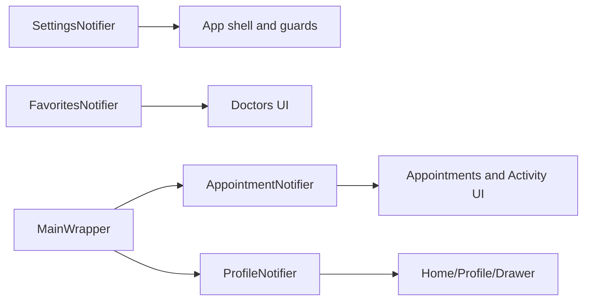

# DaktarPai - State Management and Data Flow

## 1. State Management Pattern

DaktarPai uses:
- singleton `ChangeNotifier` instances for shared app state
- `StatefulWidget` + local `setState()` for screen-local interaction state

No external state framework is used.



## 2. Global Notifiers

### SettingsNotifier

File: `lib/features/settings/presentation/settings_notifier.dart`

Tracks and persists:
- theme mode
- inactivity timeout
- drawer hint visibility
- notifications enabled
- medical records lock
- biometric flags
- 2FA flag

### ProfileNotifier

File: `lib/features/profile/presentation/profile_notifier.dart`

Tracks profile-facing values such as name, avatar, country/location signal, and currency symbol.

### FavoritesNotifier

File: `lib/features/doctors/presentation/favorites_notifier.dart`

Tracks favorite doctor IDs and exposes toggle/read helpers.

### AppointmentNotifier

File: `lib/features/appointments/presentation/appointment_notifier.dart`

State includes:
- `_appointments`
- `_pendingReviews`
- `_pendingComplaints`
- `actionRequiredItems` (Combined and sorted getter for UI)
- `_isLoading`
- `_error`

Core behavior:
- `initializeRealtime()` configures global appointment realtime ownership
- listens to Supabase auth-state stream to subscribe/unsubscribe safely
- `fetchAppointments()` loads cache first, then fetches appointments + pending reviews concurrently
- `removePendingReview(...)` updates review carousel state immediately after submission

## 3. Shell Lifecycle Data Flow

`MainWrapper` is a lifecycle coordinator:
- initializes appointment realtime once
- performs initial silent `fetchAppointments()` and `loadProfile()`
- on `AppLifecycleState.resumed`, triggers silent refresh for appointments/profile

This avoids stale state after long background sessions.

## 4. Repository Data Flow Pattern

```text
Screen/Notifier -> Repository -> Supabase/API -> Repository -> UI state update
```

Repository snapshot:

| Repository | Main data source |
|---|---|
| `AuthRepository` | `supabase.auth.*` |
| `HomeRepository` | Home feed orchestration |
| `DoctorRepository` | doctors/clinics/schedules/favorites/analytics RPC |
| `RouteRepository` | OSRM + Supabase edge function (`route-proxy`) |
| `AppointmentRepository` | `appointments`, `appointment_history`, `reviews`, realtime |
| `MedicalRecordRepository` | `medical_records` + storage |
| `ProfileRepository` | `profiles`, `saved_patients`, storage |
| `SettingsRepository` | MFA/settings server operations |
| `TrustedDeviceRepository` | `trusted_devices` + secure storage |
| `BookingDraftRepository` | local booking draft persistence |
| `AppointmentSecureCacheRepository` | local encrypted appointment cache |

## 5. Caching and Manual Refresh Behavior

Doctor list/specialty repository methods use short-lived in-memory caches with `forceRefresh` support.

Manual refresh paths use cache bypass:
- Home screen refresh -> `forceRefresh: true`
- Popular doctors refresh -> `forceRefresh: true`
- Featured doctors refresh -> `forceRefresh: true`

## 6. Appointment Data Flows

### Booking flow
1. Step 1 (`PatientDetailsScreen`) prepares payload
2. Step 2 (`AppointmentConfirmationScreen`) confirms booking data
3. Step 3 (`DummyPaymentScreen`) finalizes and schedules notification behavior
4. Optional calendar export from confirmation/success actions

### My Appointments flow
- screen subscribes to `AppointmentNotifier`
- screen no longer owns realtime channel setup
- notifier drives appointments list and pending reviews
- pull-to-refresh remains available in all states

### Review flow
1. pending card/dialog triggers `submitReview(...)`
2. notifier/screen removes or refreshes reviewed item
3. activity log uses `has_review` to suppress duplicate review CTA

### Timeout & Complaint flow
1. `pg_cron` auto-marks confirmed appointments as `waiting` once `start_time` + `max_wait_time` passes.
2. `pg_cron` auto-marks `waiting` appointments as `missed` after a 15-minute grace period.
3. If notifications are enabled, a locally scheduled timeout alert fires perfectly in sync with the database's missed status.
4. Realtime subscription triggers `fetchAppointments()`, pulling in the new missed appointment.
5. Pending card (Appointments Screen) or Activity row (Account Activity) triggers `ComplaintDialog`.
6. User selects recipient (support or doctor) and submits.
7. Notifier/screen removes the complaint from the pending queue instantly.

### Activity log flow
1. Settings -> Account Activity
2. `fetchActivityLog(userId)` reads `appointment_history`
3. same method cross-checks user `reviews` and injects `has_review`
4. UI renders timeline cards with conditional review action

## 7. Local Screen State Patterns

Common local state patterns:
- `_isLoading`, `_isProcessing`, `isSubmitting`
- `mounted` checks before UI updates
- dialog-local mutable state via `StatefulBuilder`
- try/catch with snackbar feedback
- timer-based analytics in doctor details screen (`_viewTimer`)

## 8. Non-Notifier Services

- `AppointmentNotificationService`
- `ErrorTelemetryService`
- `DeviceIntegrityService`
- `BiometricAuthService`
- `SensitiveActionStepUpService`

## 9. External Dependencies (Highlights)

- `supabase_flutter`
- `go_router`
- `flutter_local_notifications`
- `local_auth`
- `flutter_secure_storage`
- `connectivity_plus`
- `flutter_map` + `latlong2`
- `geolocator`
- `map_launcher`
- `add_2_calendar`
- `intl`
- `freezed` + `json_serializable`
- `crypto`
- `uuid`

## 10. Error Handling Note

`AppointmentRepository.cancelAppointment()` now uses typed `AppFailure` mapping for backend/network/general failures so cancellation feedback is consistent and user-safe.
